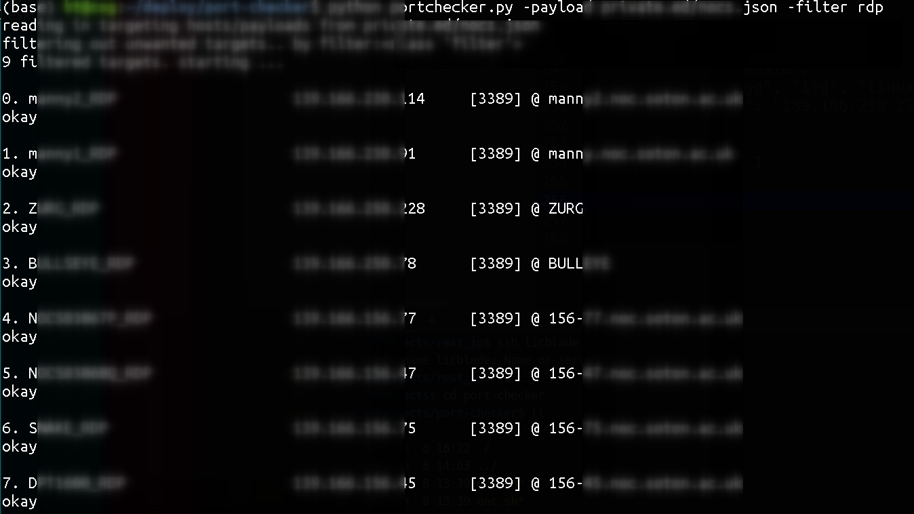

# probe/check host/ports
**input:** a json payload of list of host/ports with other descriptive attributes

**return:** a json resulting list, each combines payload and result

**usage:** structure: portchecker.py --> probe_ip_port.py(as a class)

** (no ve needed if emailing/templates is not used) **
otherwise: 
```
python3 -m venv ./ve_portchecker
source ve_portchecker/bin/activate
pip install -r r.txt
python portchecker.py -h
```




## todo

moved